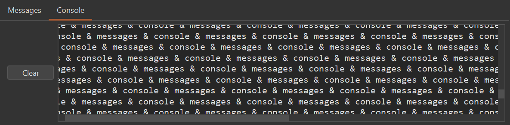

There are two tabbed message areas at the bottom of the screen.

The *Console* tab is used at runtime for displaying console output and entering console input
during the execution of a program. By default, console input is entered directly into
the console window. However, if desired, enabling the *Settings → Use dialog for user input* option
prompts you with a popup dialog instead.

The *Messages* tab is used for other messages such as assembly errors and information.
You can click on an assembly error message to select the corresponding line of code in the editor.
