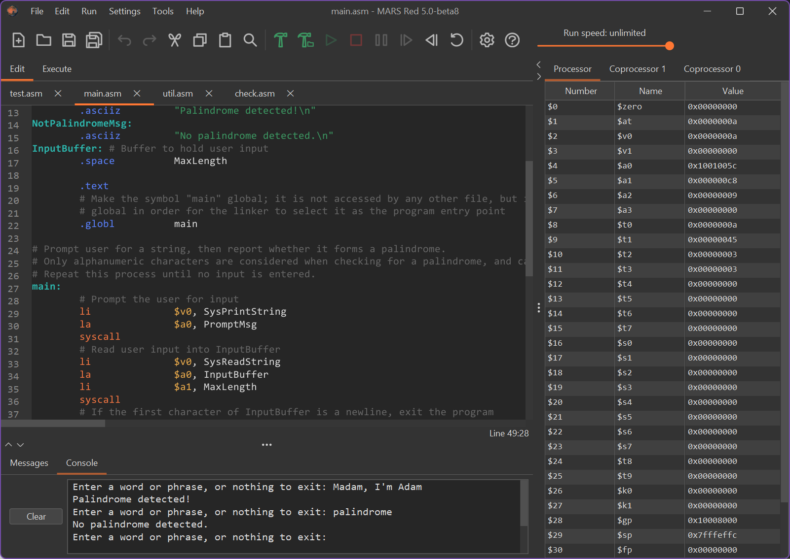

# **MARS Red**

MIPS Assembler and Runtime Simulator

MARS Red is a modern derivative of [MARS](https://courses.missouristate.edu/KenVollmar/MARS/index.htm)
(MIPS Assembler and Runtime Simulator), a Java-based desktop application and
command-line tool originally developed by Pete Sanderson and Kenneth Vollmar.
Both have since retired, leaving MARS without any updates since 2014.
For more information about the developers, see below.

The MARS Red IDE provides editing and assembling capabilities, but its real
strength lies in its support for interactive debugging. The programmer can easily add or 
remove execution breakpoints after assembling, execute the program in slow motion or
one instruction at a time, undo instructions, and view and directly edit registers
and data in memory while the program is running.

## Pete Sanderson

Often seen as `DPS` within the source code, Dr. Pete Sanderson is an
Emeritus Professor of Computer Science in the Mathematical Sciences Department at
[Otterbein University](https://www.otterbein.edu/),
which is located in Westerville, OH.

- Email: [psanderson@otterbein.edu](mailto:psanderson@otterbein.edu)
- Website: [faculty.otterbein.edu/psanderson](http://faculty.otterbein.edu/psanderson/)

## Kenneth Vollmar

Often seen as `KENV` within the source code, Dr. Ken Vollmar is an
Emeritus Professor in the Computer Science Department at
[Missouri State University](https://www.missouristate.edu/),
which is located in Springfield, MO.

- Email: [KenVollmar@missouristate.edu](mailto:KenVollmar@missouristate.edu)
- Website: [courses.missouristate.edu/KenVollmar (now defunct)](https://web.archive.org/web/20240907025417/https://courses.missouristate.edu/KenVollmar/)
